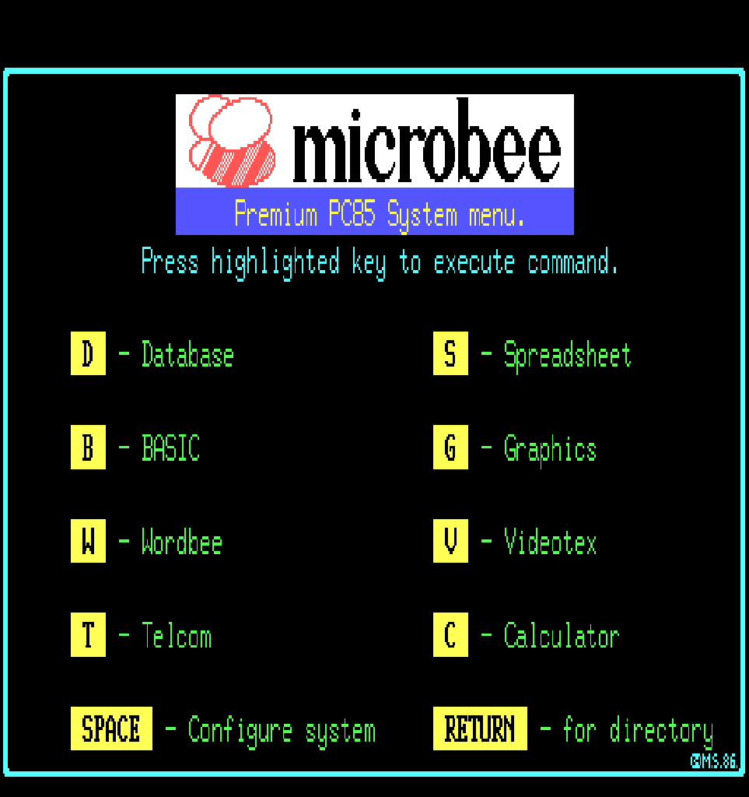

# MicroBee PC85 core for MiSTer

An FPGA implementation of the Australian **MicroBee PC85** and **Premium PC85** —
The last of the Standard ROM based MicroBees to be produced in 1985 and introduces a new graphical menu system that allows easy selection of built in software packages. The machine uses essentially the same hardware as the earlier 32K Communicator Series III with some software upgrades, additional bundled software packages and a new PAK ROM to provide the PC85 menu functionality.

| Model | What it is |
|---|---|
| **PC85** | 32K, monochrome, BASIC 5.25e plus six PAK ROMs and a Net ROM. The default |
| **Premium PC85** | The same machine with the Premium video board — colour, attribute RAM, 8 PCG banks — and its own ROM set |




## Core features

- **PC85 System Menu** on both models
- **PC85/PPC85 based software packages** - including Basic, WordBee, Telecom, Calculator, Monitor, Database, Spreadsheets (ROMs required)
- **Cassette LOAD** from DGOS `.tap` images at 300 and 1200 baud, with the core
  generating the Kansas City waveform so the machine's own ROM decoder reads it
- **PCG graphics**, dual fonts, and on the Premium colour and attribute RAM
- **Sound** through the speaker bit
- **Keyboard** with a symbolic US mapping, or positional via the OSD
- **Cold Reset**, which clears memory as the power switch did

## Installing on MiSTer

The core name is **`MicroBee-PC85`**

**It is deliberately not `MicroBee`.** That name belongs to the original
four-model disk core, and both cores auto-load `boot0.rom` from their own games
directory. A shared name would mean a shared directory and two incompatible
`boot0.rom` bundles overwriting each other — silently, since neither core can
tell it loaded the wrong bytes. The two install side by side and do not interfere.

```
/media/fat/_Computer/MicroBee-PC85_YYYYMMDD.rbf
/media/fat/games/MicroBee-PC85/
        boot0.rom  boot1.rom  boot2.rom
        *.tap
```

**Three files, and each is a plain concatenation you build once.** These are
1980s ROMs; they never change. Use the files exactly as downloaded - no padding,
no renaming, no splitting.

**PC85** — seven ROMs, all 8K:

```bash
cat standard_pc85_a.rom standard_pc85_b.rom standard_pc85_c.rom standard_pc85_d.rom standard_pc85_e.rom standard_pc85_h.rom standard_pc85_i.rom > boot0.rom          # 57,344 bytes
```

**Premium PC85** — nine ROMs; `a`, `f` and `g` are 16K, the rest 8K:

```bash
cat premium_pc85_a.rom premium_pc85_b.rom premium_pc85_c.rom premium_pc85_d.rom premium_pc85_e.rom premium_pc85_f.rom premium_pc85_g.rom premium_pc85_h.rom premium_pc85_i.rom > boot1.rom
                                             # 98,304 bytes
```

**The character ROM**, shared by both:

```bash
cp character_4k.rom boot2.rom                     # 4,096 bytes
```

| File | Contents | Size |
|---|---|---|
| `boot0.rom` | PC85: ROM-A/B, PAK0, Net, PAK1, PAK4, PAK5 | 57,344 |
| `boot1.rom` | Premium PC85: the same plus PAK2 and PAK3, its own set | 98,304 |
| `boot2.rom` | `character_4k.rom` — the character ROM, shared by both | 4,096 |

**Letter order** The letters are the ROM designations, and `d`
is the **Net ROM** — it sits between PAK0 and PAK1, which is right. 
Alphabetical order is the correct order. Do not sort by what the ROM
does.

**The Premium's `a`, `f` and `g` are 16K and stay whole.** ROM-A is a banked 16K
BASIC, and PAK2 and PAK3 are 16K chips whose upper halves the machine addresses
as PAK10 and PAK11 — which is where the Premium's Spreadsheet and Database come
from. Concatenate them as they are; the core splits them.

**Order matters and size will not tell you if you got it wrong** — the same
ROMs concatenated in the wrong order come to exactly the same length as the
right ones. BASIC must be first. The core samples the Shell's own signature at
its expected offset, and the Net ROM's, and warns in the OSD if either is
missing.

**All nine must be present in each bundle**, and this is not the usual "or a
feature is missing". The System Menu these machines boot into *enumerates the
ROMs it can see* and builds itself from them, so a short bundle gives you a
**wrong menu** rather than a missing entry.

You need only the bundle for the model you use — `boot1.rom` can be absent if you
never select the Premium — but `boot2.rom` is required by both. Without it the
machine runs perfectly with **nothing legible on screen**: every glyph fetches as
zero and only the cursor shows.

`bootN.rom` files are picked up automatically when the core starts. There is
nothing to load from the OSD.

ROMs are **not** included — they are copyrighted. `docs/NOTES.md` §5 lists the
SHA1 of every image this core has been verified against.

## Using it

Both models cold-boot straight to BASIC — there is no disk and nothing to mount:

```
Applied Technology microbee Colour Basic. Ver 5.25e
Copyright MS 1985 for MicroWorld Australia
>
```

**Once PAK switching lands** this is what you will see only with the PAK sockets
empty; a full bundle will come up in the System Menu instead, with BASIC as one
entry on it.

### Cold Reset — when Reset is not enough

**Reset does not clear memory.** BASIC comes back with your program still there,
which is what the real machine does too — you would type `NEW`. But a
machine-code game loaded from tape owns the machine and leaves no prompt to type
it at, so there is otherwise no way back to a usable BASIC short of restarting
the core.

**`Cold Reset` in the OSD is the answer, and it is a real MicroBee control** — on
the hardware you hold **ESC** while pressing **RESET**. There is no RESET key to
hold it against here, so it lives on the menu. It zeroes the machine's RAM and
restarts, which is the difference between the reset button and the power switch.

You can tell which one you got from the screen: a plain **Reset** returns you to
`Ready` and a `>` prompt, while **Cold Reset** reprints the full copyright banner
exactly as it does at switch-on.

It works on both models.

### Loading from tape

Mount a DGOS `.tap` in the OSD and type `LOAD` in BASIC, exactly as on the real
machine. **There is no Play button, because the MicroBee had no tape motor
control** — you pressed PLAY yourself, so the core watches for the ROM entering
its tape sampling loop and starts the tape itself. `Rewind Tape` is the one
transport control, matching ubee512.

Both speeds work, 300 and 1200 baud, switched automatically from the tape's own
header as the hardware does. The core **generates the Kansas City waveform** from
the file rather than injecting bytes behind the ROM's back, so a load takes the
time it really took and the machine's own decoder is what reads it. Tape audio is
mixed in at a low level and defaults to On — a load runs for minutes against a
static screen, and the sound is the only sign it is working.

**Saving to tape is deliberately not implemented.** Nobody realistically archives
to cassette from a MiSTer core, and it would need a decoder and a writable image
rather than the encoder LOAD needs.

## Keyboard

Default is **Symbolic**: the symbol keys give you what is printed on the keycap,
assuming a **US layout**. Type `@` and you get `@`. This is what ubee512 does and
what almost everyone wants, so unless you are chasing a compatibility problem you
can stop reading here.

It has to be a choice because the real MicroBee has an **ASCII-63** keyboard,
where Shift moves the whole digit row one place left. Eleven keys sit somewhere
other than a modern keyboard puts them — 15 of the 42 symbol combinations. Switch
the OSD to **Positional** and you get the machine's own layout, key for key:

| You press | Positional gives | | You press | Positional gives |
|---|---|---|---|---|
| `` ` `` | `@` | | Shift+`9` | `)` |
| Shift+`` ` `` | `` ` `` | | Shift+`0` | `0` (nothing) |
| Shift+`2` | `"` | | Shift+`-` | `=` |
| Shift+`6` | `&` | | `=` | `^` |
| Shift+`7` | `'` | | Shift+`=` | `~` |
| Shift+`8` | `(` | | `;` / Shift+`;` | `:` / `*` |
| | | | `'` / Shift+`'` | `;` / `+` |

Use Positional if software reads the key matrix directly and a synthesised Shift
would confuse it. Everything else — letters, digits, Space, Enter, Ctrl, the
cursor keys and Shift on its own — is identical in both modes and always sits on
its real matrix position.

Other keys, in both modes: **Home** is Linefeed, **End** is Break, **Caps Lock**
is Lock, **Delete** is DEL.

One gap: no MicroBee key produces `_`, so Shift+`-` does nothing in Symbolic
mode. Printing `=` instead was the alternative, and a wrong character you do not
notice is worse than a key that does nothing.

MiSTer's own key remapping cannot substitute for this. It is system-wide rather
than per-core, and single-key-to-single-key with no macro support, so it cannot
change shift state — and Shift+`2` → `@` is exactly that.

### If you have a UK keyboard

**Symbolic mode assumes a US layout**, because MiSTer hands cores raw PS/2 scan
codes and never says what is printed on the keycaps — the core has to guess, and
it guesses US. Five keys will not match a UK board:

| Your keycap | You get |
|---|---|
| Shift+`2` = `"` | `@` |
| Shift+`'` = `@` | `"` |
| Shift+`3` = `£` | `#` |
| `#` / `~` (left of Enter) | `\` / `\|` |
| `\` / `\|` (left of Z) | nothing |

Everything else is correct. A UK option is straightforward to add — it is one
more column in the same lookup table — so **open an issue if you want it**. Two
combinations would stay dead either way, since the MicroBee has neither `£` nor
`¬`.

For context, this is not unusual: the BBC Micro core hardcodes the *opposite*
assumption, mapping the ISO-only key left of Z that a US keyboard does not have,
and leaves its own ASCII-63 digit row unmapped in either direction.

## Credits and attributions

### Core development

- **Diego Viso** ([@diegov-au](https://github.com/diegov-au)) - core development, hardware testing and verification.


This core was written from the **factory schematics** wherever possible. Where a
question could not be answered from a drawing, the emulators below were the
reference, and the project is indebted to all of them.


## Licence

GPL-2.0, matching the MiSTer framework in `sys/`. The `tv80` CPU is MIT.
